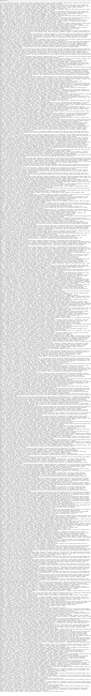
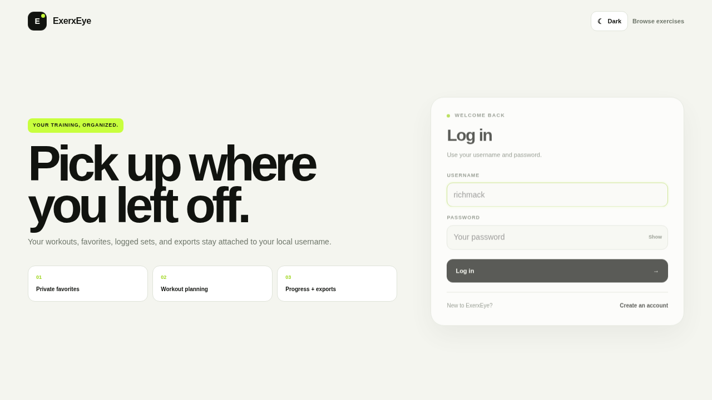
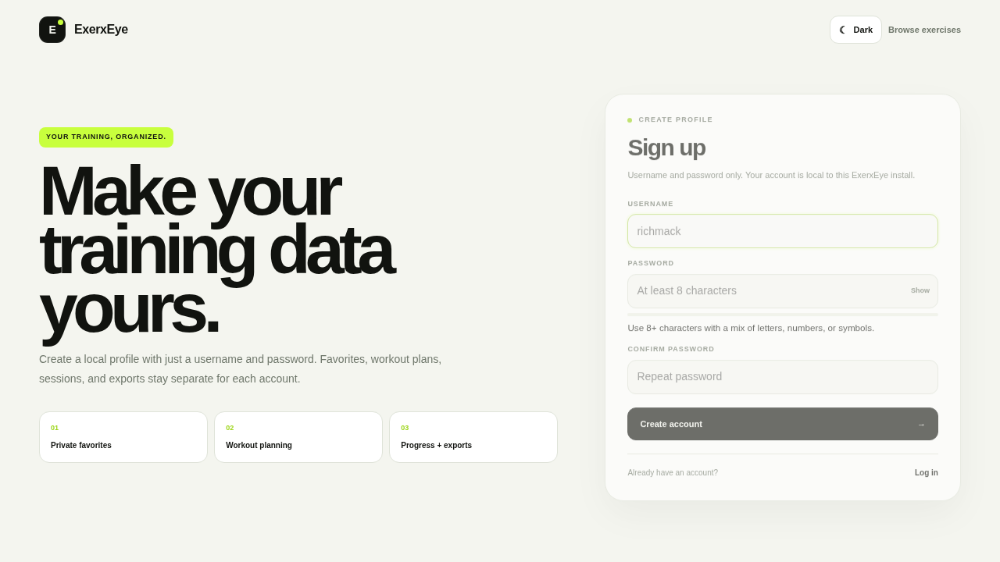

# ExerxEye

<!-- EXERXEYE-GITHUB:START -->

[](https://github.com/iamrichmack111/exerx-eye/actions/workflows/ci.yml)
[](https://python.org)
[](https://flask.palletsprojects.com/)
[](https://playwright.dev/)


## Screenshots

### Exercise Library



### Login



### Signup



<!-- EXERXEYE-GITHUB:END -->

ExerxEye is a Flask exercise intelligence and training workspace backed by SQLite. It combines a searchable exercise library with private user accounts, favorites, workout planning, live session logging, analytics, exports, and a motion-rich responsive interface.

## New in this build

### V7 planning and session review

- **Weekly Planner**: assign saved workouts to Monday-Sunday and keep recovery/flexible days open.
- **Today-aware Quick Start**: Home prioritizes the workout scheduled for the current day.
- **Active-session recovery**: unfinished sessions are surfaced on Home and starting another workout routes you back to the active one.
- **One active session at a time** to prevent accidental duplicate workout logs.
- **Training preferences**: set a weekly session goal and default rest timer from Account.
- **Weekly goal meter** on Home and Planner.
- **Post-workout review screen** with duration, working sets, exercises, total volume, average RIR, top estimated 1RM, and per-exercise breakdown.
- **Session RPE + session note** for a lightweight after-workout reflection.
- **Session summaries are reusable history**: recent completed workouts link back to their review screen.
- **Full account JSON now includes preferences, weekly schedule, and reviewed sessions.**
- **Schema v6 migration** adds planning preferences, schedule mapping, and session review fields without resetting existing user data.

### V6 product improvements

- **Training Home** after login with 7-day sessions/sets/volume, 30-day activity, quick-start, recent sessions, and current estimated-1RM bests.
- **Editable workout plans**: rename plans, edit notes, change sets/reps/target weight, and reorder exercises before training.
- **RIR + set notes**: optionally log repetitions-in-reserve and a short note with each set.
- **Smarter active sessions**: already-logged sets appear under each movement and the rest timer auto-starts after a set is recorded.
- **Progress ranges and charts** for 7, 30, 90, and 365 days with animated daily-volume bars and a PR board.
- **Exercise history**: recent personal performance is visible on each exercise page and the workout-builder weight field pre-fills from the last logged set.
- **Installable PWA shell** with cached static assets for faster repeat loads.
- **Schema v5 migration** automatically adds effort/note fields to existing SQLite databases; V7 advances existing databases to schema v6 for planning/review data.


- **Signup / login / logout** with securely hashed passwords.
- **Private per-user data**: favorites, workouts, sessions, logged sets, progress, and exports are isolated by account.
- **Account dashboard** with training totals and quick actions.
- **Export center** with:
  - Progress history CSV
  - Workout plans CSV
  - Favorites CSV
  - Full account JSON bundle
  - Exercise-library CSV
- **More motion**: route transitions, animated ambient backgrounds, reveal/stagger effects, button ripples, card perspective tilt, progress animation, auth-page orbit animation, export-card shimmer, and a workout-completion celebration.
- Password strength and confirmation feedback on signup.
- Existing exercise comparison, command palette, themes, rest timer, personal bests, and related-exercise tools remain included.
- `prefers-reduced-motion` is respected.

## Fastest way to run

```bash
chmod +x run.sh
./run.sh
```

The launcher creates `.venv`, installs missing dependencies, generates a persistent local Flask secret in `instance/.secret`, and starts the app at:

```text
http://127.0.0.1:8000
```

## Manual setup

```bash
python3 -m venv .venv
source .venv/bin/activate
pip install -r requirements.txt
export EXERXEYE_SECRET="$(python -c 'import secrets; print(secrets.token_hex(32))')"
python app.py
```

## Accounts and privacy

Exercise browsing and the public library API work without an account. Saving favorites, creating workouts, logging sets, viewing personal progress, opening the account dashboard, and private exports require login.

Passwords are stored as Werkzeug password hashes; plaintext passwords are not stored. For a deployed copy, set a strong persistent `EXERXEYE_SECRET` environment variable.

## Export center

After login, open **Insights → Export center** or visit `/exports`.

| Export | Format | Contents |
| --- | --- | --- |
| Progress history | CSV | exercise, workout, reps, weight, volume, estimated 1RM, RIR, note, date |
| Workout plans | CSV | workout notes, exercises, sets, reps, target weights |
| Favorites | CSV | saved exercises and movement metadata |
| Full account | JSON | account metadata, favorites, workouts, progress, preferences, weekly schedule, session reviews |
| Exercise library | CSV | public core movement database |

## Training features

- Search/filter exercises by muscle, equipment, difficulty, and text query.
- Favorite movements per account.
- Compare up to three exercises side-by-side.
- Create, duplicate, and delete workout plans.
- Add/remove/reorder exercises and edit target sets, reps, and weight.
- Start sessions and log live sets with optional RIR and set notes.
- 30/45/60/90/120-second persistent rest timer with a user-selected default.
- Session completion percentage, remaining sets, and volume.
- Personal bests, total volume, estimated 1RM, date-range progress filtering, and animated volume trends.
- Random exercise generator and library analytics.
- JSON API under `/api/*` plus `/health`.

## Interface shortcuts

- `Ctrl/Cmd + K` — command palette
- `/` — focus global exercise search
- `R` — randomizer
- Light/Dark mode toggle — follows system preference the first time and remembers your choice

## Production-style run

```bash
export EXERXEYE_SECRET="replace-with-a-long-random-secret"
gunicorn --bind 0.0.0.0:8000 --workers 1 --threads 4 app:app
```

SQLite is intentionally served with one Gunicorn worker and multiple threads to avoid multiple worker processes racing on the same local database file.

## Docker

```bash
docker compose up --build
```

For a deployed Docker instance, pass a persistent secret, for example:

```bash
EXERXEYE_SECRET="your-long-random-secret" docker compose up --build
```

## Tests

```bash
source .venv/bin/activate
pip install -r requirements-dev.txt
python -m pytest -q
```

The Flask tests cover signup/login, private workout flow, user-data isolation, exports, weekly planning, preferences, and session review routes. Database tests also cover schema migration v6, active-session handling, planner persistence, and export inclusion.

## Environment variables

- `EXERCISE_DB_PATH` — SQLite path, default `instance/exercises.db`
- `EXERCISE_CSV_PATH` — seed CSV, default `data/gym_exercise_dataset.csv`
- `EXERXEYE_SECRET` — Flask session secret
- `PORT` — Flask development port, default `8000`
- `FLASK_DEBUG=1` — enable Flask debug mode
## V8 account + appearance update

- **No email required:** sign up and log in with a username and password only.
- **Dark mode:** a dedicated Light/Dark toggle appears in the main app and auth screens, follows the system preference on first use, and remembers the choice locally.
- Existing databases remain compatible; legacy email values are retained internally only for migration compatibility and are no longer shown, used for login, or included in account exports.


## V9 visual redesign

The V9 interface uses a single premium fitness design system with a restrained lime accent, cleaner cards, simpler navigation, reduced visual effects, stronger mobile layout, and a dedicated light/dark mode rather than multiple competing theme skins.


## V10 organization + training UX

- Navigation is grouped into **Home / Explore / Train / Track** so planning and analytics no longer compete as separate top-level tabs.
- Home is organized into **Today**, **This Week**, **Insights**, and **Recent Activity**.
- Training Home now shows current/best streaks, weekly completion, 30-day volume, and muscle-volume distribution.
- Workout Generator can draft Full Body, Upper, Lower, Push, Pull, or single-muscle plans with optional equipment filtering.
- Exercise Library remembers recently viewed movements locally in the browser.
- Active sessions reuse the last logged reps/weight/RIR, provide ± rep/weight quick controls, mark completed exercises, and include a sticky **Next unfinished** action.
- Motion is purposeful: staggered reveals, chart growth, weekly completion pulses, generator/navigation transitions, and workout focus feedback with reduced-motion support.
